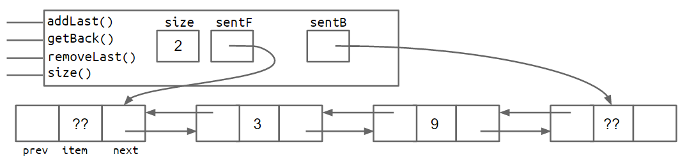
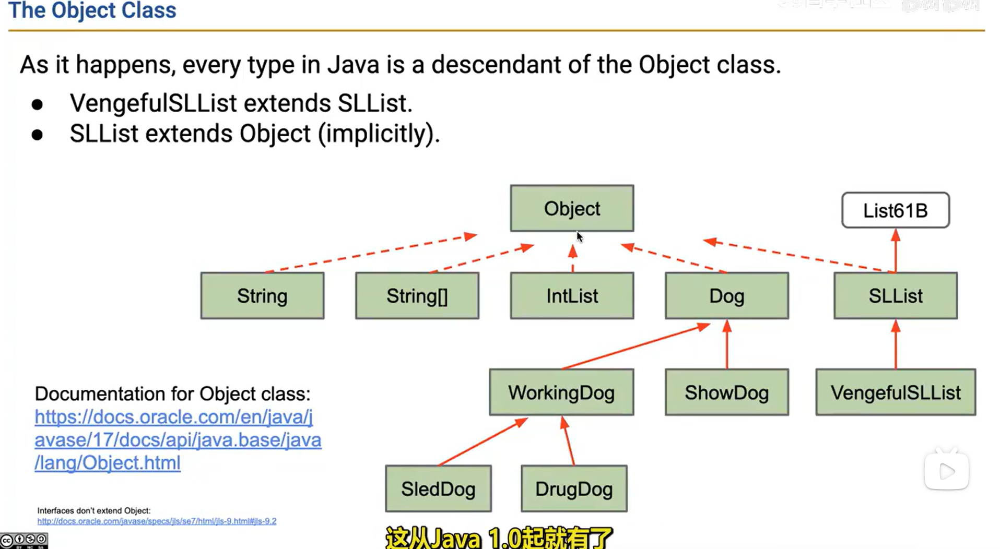

# lab

lab01: complted Arithmetic.java 14/8/2024

# lec

## lec4 SLList:

### note

SLList (Static Linked List) provides

```cpp
 addFirst()
 getFirst()
 addLast()
 getLast()
 size()
```

etc.

1. `SLList` contains `IntNode ` class (nested class)
2. We can use recursion of `size(IntNode p)` and `size() ` to compute the size of SLList. But a better choice is declare `private int size` in `SLList`. (Buying additional space for time)
3. Sentinel is important!(Actually I didn't totally understand why we need a sentinel.)

### wisdom

- Less for Users of class to understand (public method -> interface. private method -> implements)

## lec5:DLList and arrays

### note

Although array is introduced at the end of this lec,I'm already familiar with it.The exact difference of array between C++ and java is that in java array is reference type which means array is actually a pointer.

| feature           | C++          | java         | python           |
| ----------------- | ------------ | ------------ | ---------------- |
| length            | fixed        | fixed        | dynamic          |
| data type         | strong type  | strong type  | wake type        |
| n dimension array | support      | support      | only nested list |
| lib support       | \<algorithm> | Arrays.class | list library     |

Wow! welcome to DLList.I completed it successfully by adding the LNode and made a perfect constructor.

```java
 LNode(LNode p, Cheese i, LNode n) {
            prev = p;
            p.next = this;
            item = i;
            next = n;
            n.prev = this;

        }
```

but be careful about the terrible empty problem solved last lec.

```java
  public void initSentinel() {
        sentFront = new LNode(null, null);
        sentBack = new LNode(null, null);
        sentFront.next = sentBack;
        sentBack.prev = sentFront;
    }
```

I called this in DLList constructor to ensure there must be two faithful sentinel in DLList(one head and one tail).Looks like this.



And what we should code behind adding the node is one simple line!

```java
  public void push_front(Cheese x) {
        new LNode(sentFront, x, sentFront.next);    // what a beautiful line!
        size++;  //  cache the size while we do insert or remove node makes it easier for us to get the size
    }
```

The amazing process like this **Watch the arrow carefully**


### harvest

- 2 sentinel
- doubly node (with great constructor)
- `new LNode(sentFront, x, sentFront.next);`

## lec8 interface and implements

### harvest

<b>interface is an abstraction of behavior</b>

inheritance contains <i> interface</i> and <i> partial implementation</i> the latter includes some <b>default code </b>.

<br>

<b>Any type in java has 2 type <i>dynamic type</i>(runtime type) and <i>static tpye</i>(declaration ype) </b>

here are the definition of 3 class
<code>public interface GenericList\<Item>
public class Alist\<Item> implements GenericList\<Item>
public class SLList\<Item> implements GenericList\<Item></code>

Suppose we have code follows

```java
GenericList<Integer> gelAList = new AList<Integer>();
GenericList<Integer> gelSLList = new SLList<Integer>();
```

| Reference | dynamic type | static type |
| --------- | ------------ | ----------- |
| gelAList  | Alist        | GenericList |
| gelSLList | SLList       | GenericList |

## lec9 extends and supper

### note

- is-a and has-a
- encapsulation
- <b> complier is only checking based on static type</b>

This lecture we build VengefulSLList and RotatingSLList.Both of them are the subclass of SLList.

```java
public class VengefulSLList<Item> extends SLList<Item>
public class RotatingSLList<Item> extends SLList<Item>
```

is-a relationship refer to subclass before keyword of extends is a subset of superclass after keyword of extends.

$$
\begin{array}{c}
\boxed{
    \begin{array}{c}
    \text{SLList} \\
    \\
    \boxed{\text{VengefulSLList}} \quad \boxed{\text{RotatingSLList}}
    \end{array}
}
\end{array}
$$

<br>

**From top to bottom ,top has bottom ,bottom is a top.**


<br>
<b> You can use super in subclass to visit private method of super class</b>
here is a piece of code in  <code>RotatingSLList </code>

```java
  public void rotate()
    {
      super.addFirst(super.removeLast());
    }
```

# project

## pro0

The idea of moving one single tile and then a column then the whole board is great. And the most powerful idea is using `setViewingPerspective` method to control.Show my game.

